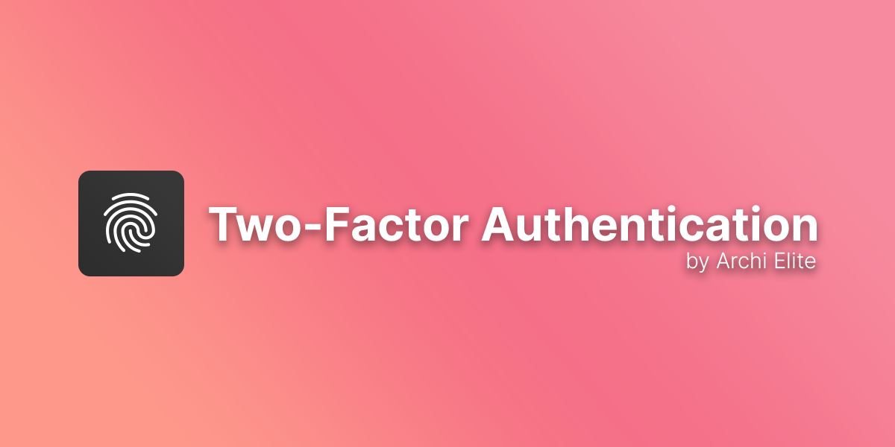
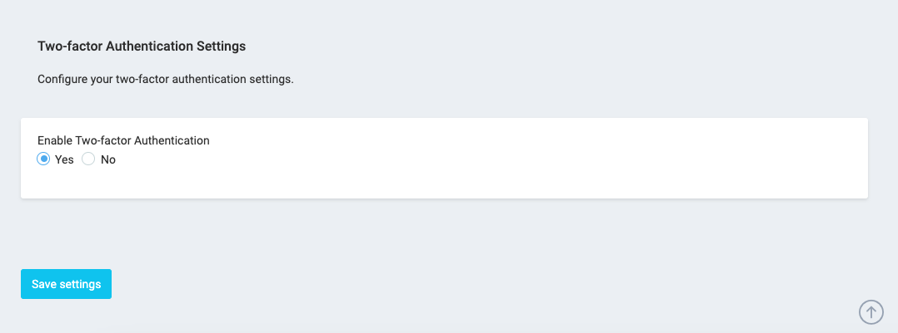
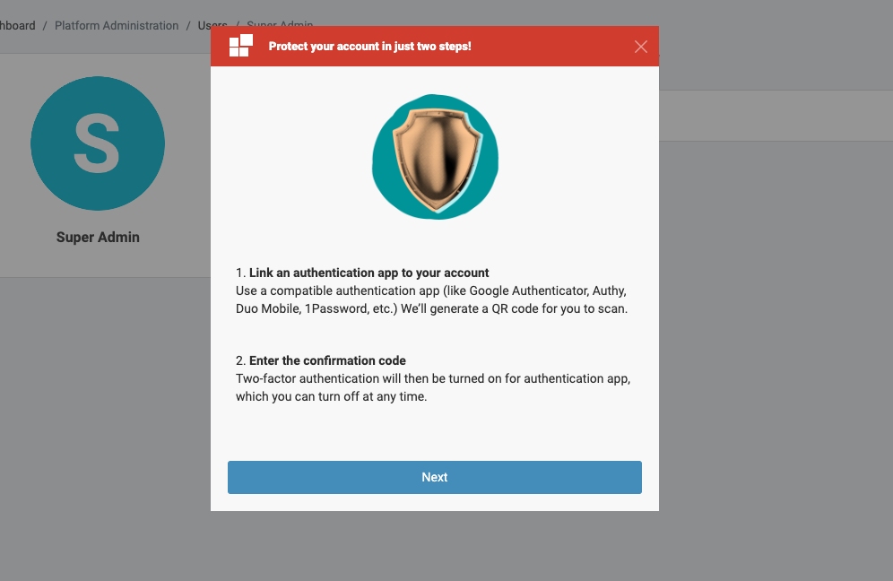

# Two-factor Authentication for Botble CMS

This plugin allows you to add two-factor authentication to your Botble CMS site.

Demo video here: [https://youtu.be/Y1t6rjWYNro](https://youtu.be/Y1t6rjWYNro)

## Requirements

-   Botble core 7.0.0 or higher.

## Installation

**Install via Admin Panel**

Go to the **Admin Panel** and click on the **Plugins** tab. Click on the "Add new" button, find the **Two-Factor Authentication** plugin and click on the "Install" button.

**Install manually**

1. Download the plugin from the [Botble Marketplace](https://marketplace.botble.com/products/archielite/2fa).
2. Extract the downloaded file and upload the extracted folder to the `platform/plugins` directory.
3. Go to **Admin** > **Plugins** and click on the **Activate** button.

## Usage

First, you need to go to Admin -> Settings -> scroll down to **Two-factor Authentication** section and enable it.

To set up two-factor authentication for your account, go to **Admin** -> **My Profile** -> **Two-factor Authentication** tab.

## Contributing

Please see [CONTRIBUTING](CONTRIBUTING.md) for details.

## Security

If you discover any security-related issues, please email contact@archielite.com instead of using the issue tracker.

## Credits

-   [Archi Elite](https://github.com/archielite)
-   [All Contributors](../../contributors)

## License

The MIT License (MIT). Please see [License File](LICENSE) for more information.
